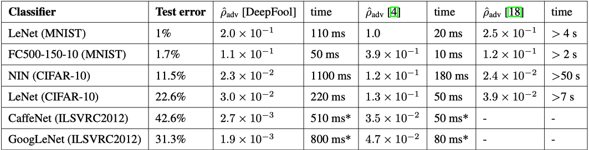
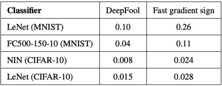

# 今日计划
- 总结之前的文献，把他们的实验内容记录下来。主要记录以下内容。
1. 实验用的网络，实验的训练集合
2. 实验的对比方法(两个方法进行对比例如愚弄率)
3. 实验中图标的内容表示

- 研究imagenet数据库如何使用，争取调试出一个用法例子

- 思考设计实验
# 启发
> We also studied crafting of 9, 000 adversarial samples using the decreasing saliency map. We found that the success rate τ = 64.7% was lower and the average distortion ε = 3.62% slightly lower. Again, decreasing pixel intensities is less successful at producing the desired adversarial behavior than increasing pixel intensities. Intuitively, this can be understood because removing pixels reduces the information entropy, thus making it harder for DNNs to extract the information required to classify the sample. Greater absolute values of intensity variations are more confidently misclassified by the DNN.

这段文字来源于The Limitations of Deep Learning in Adversarial Settings的实验部分，论文提出了JSMA这种target攻击方法。讲述将对抗样本重新进行攻击的到的攻击成功率远远的低于原来的成功率。 直观上，这是可以理解的，因为删除像素会降低信息熵，从而使DNN更加难以提取分类样本所需的信息。 DNN更容易误判强度变化的绝对值更大。这一段以后写到自己论文中也可以使用
## 文献记录
### deepfool
#### 评判标准
$$\hat p_{adv}(f)=\frac{1}{|\mathbb{D}|}\sum_{x\in\mathbb{D}} \frac{||\hat r(x)||_2}{||x||_2}$$
用$\hat p_{adv}$来表扰动的平均大小。其中$\hat r(x)$表示是对原图像x产生的扰动，用产生扰动和原图像的$l_2$范数扰动进行对比表示平均扰动的大小。

#### 实验表格

其中方法4是I. J. Goodfellow, J. Shlens, and C. Szegedy. Explaining and harnessing adversarial examples论文中的方法(FGSM)。方法18是C. Szegedy, W. Zaremba, I. Sutskever, J. Bruna, D. Erhan,
I. J. Goodfellow, and R. Fergus. Intriguing properties of neural networks. In International Conference on Learning Representations的方法。

表格中主要记录三个数据：1.算法用时间 2.扰动的平均大小 

这张表也是扰动大小的对比，表格中的数字表示$\hat p_{adv}$上一张表格中$\hat p_{adv}$用$l_2$范数表示，这张表格中用无穷范数表示，$\hat p_{adv}^{\infty }(f)=\frac{1}{|\mathbb{D}|}\sum_{x\in\mathbb{D}} \frac{||\hat r(x)||_\infty }{||x||_\infty }$

除了这些实验作者还做了一些对抗训练内容的实验。

### JSMA
#### 评判标准
由于JSMA每次修改只改动一个像素点并且对这个像素点进行加减1的操作。（这里的加减1并不是指指像素的加减一而是在机器学习归一化后的数字进行加减一，所以其实就是赋值成为最大值或者最小值，也就是直接改成黑点或者白点）。JSMA衡量的标准因此定义为了修改像素占原图中的比例。
#### 实验表格

# 链接记录
[latex公式大全](https://www.cnblogs.com/1024th/p/11623258.html) 

[latex在github上公式不显示问题](http://www.wanguanglu.com/2016/07/18/github-markdown-equation/)

